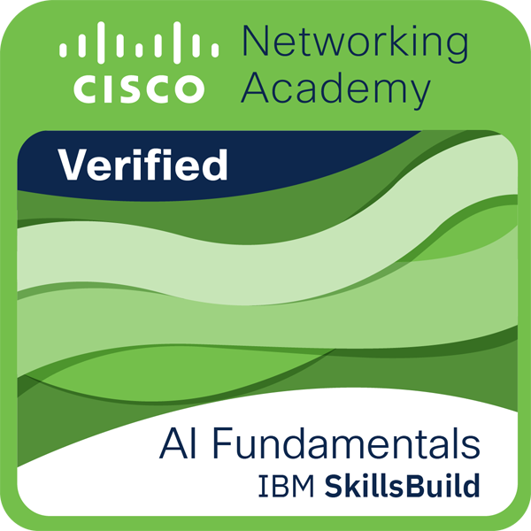
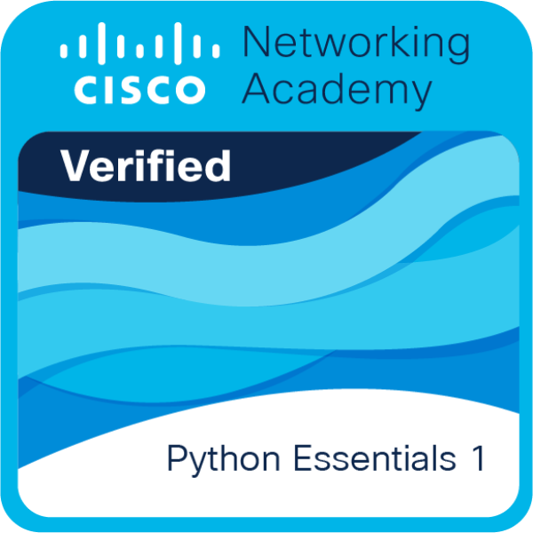
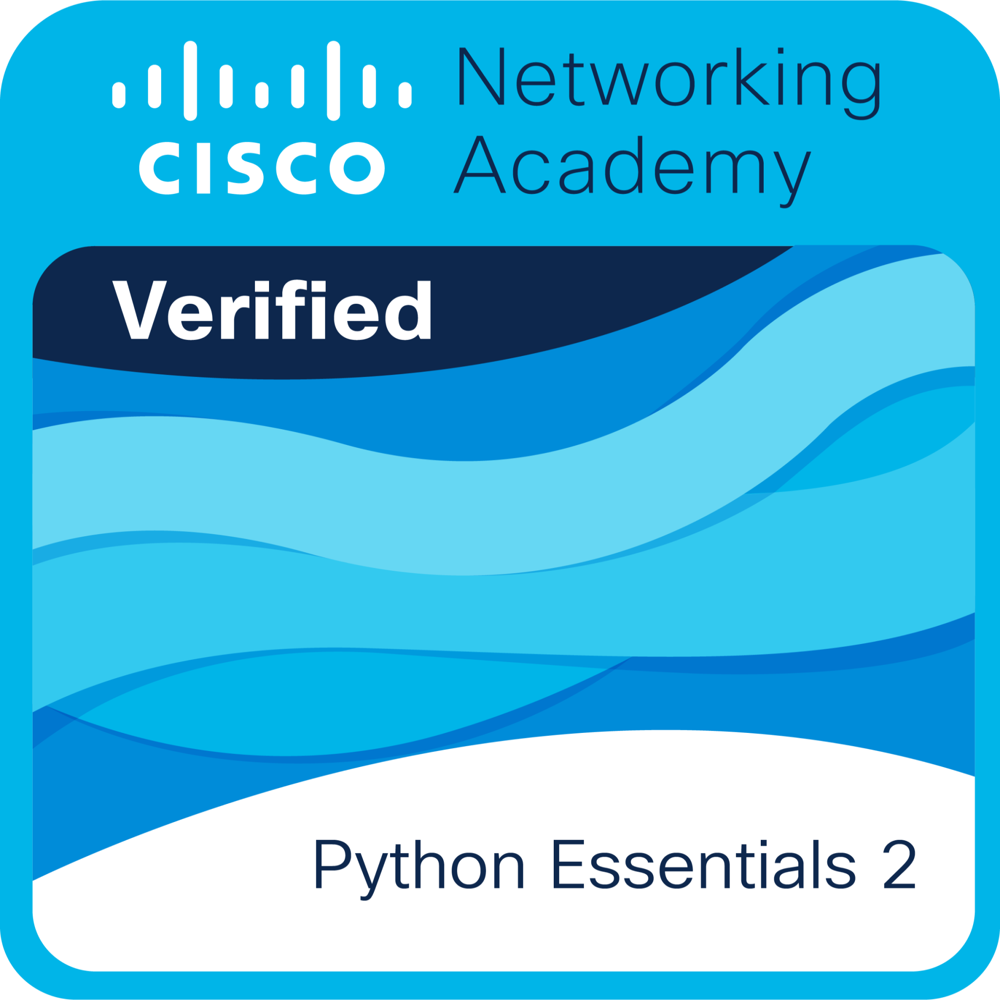

---

Every obstacle becomes an opportunity to build something better.

  🤖 Curious about how <b>AI</b> can enhance real-world experiences — always learning, refining backend logic, and exploring new frameworks to build smarter systems. 
  ♟️ Outside the terminal, I’m all about puzzles, chess matches, and decoding riddles 🔍

<h4 align="center">
  🎯 Crafting clarity from complexity.
</h4>

---

### 🏅 Badge

  
  
  

  

---

# 💻 Tech Stack:
                                    

# 📊 GitHub Stats:
 

### 🔝 Top Contributed Repo

---

> “Thanks for visiting! Keep coding, keep growing, and don’t forget to ⭐ star my projects! 🚀”

---

