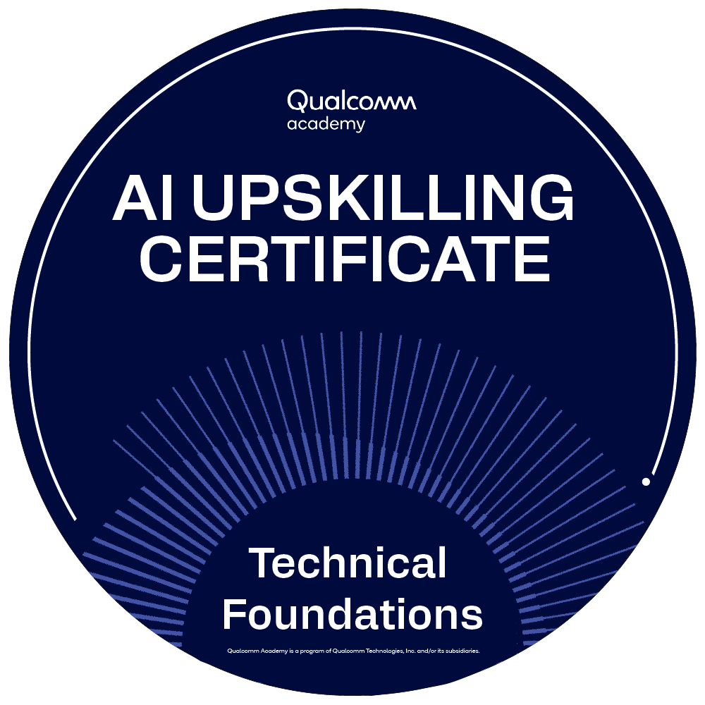
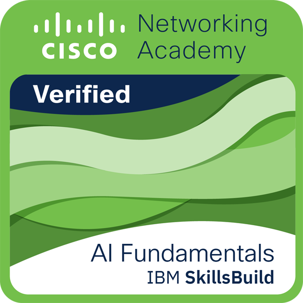
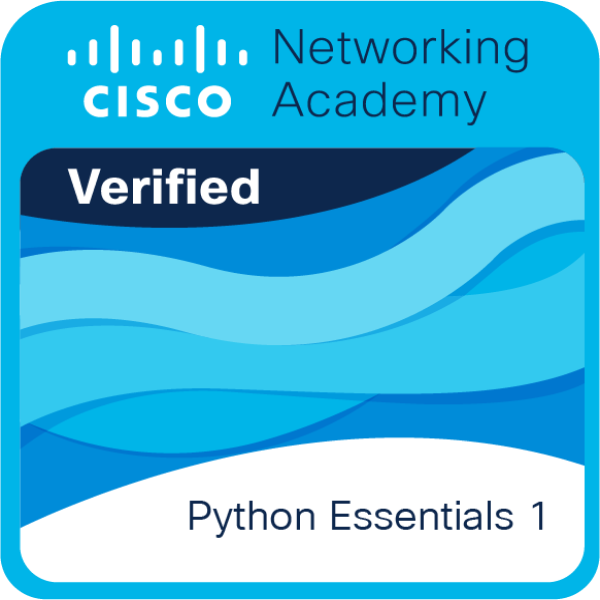
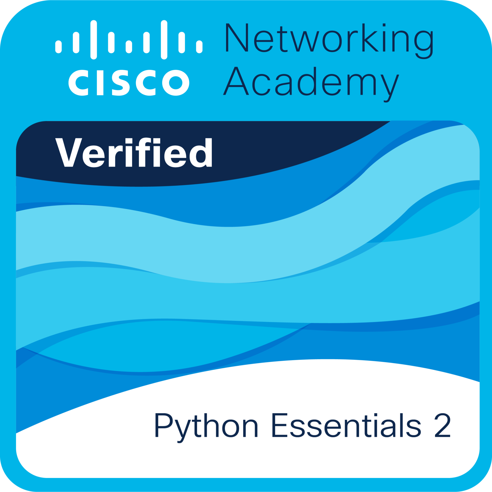

 

  <i>"Debugging: where I meet the consequences of my confidence."</i>

 

  🤖 Curious about how <b>AI</b> can enhance real-world experiences — 
  always learning, refining backend logic, and exploring new frameworks to build smarter systems.  
  ♟️ Outside the terminal — puzzles, chess matches, and decoding riddles 🔍

---

### 🏅 Badge

    
  
  
  

  

---

### 🚀 Tech Skills

<table>
<tr>
<td align="left" width="520">

### 💻 Languages

</td>
<td align="left" width="520">

### 🎨 Frontend

</td>
</tr>
<tr>
<td align="left">

### ⚙️ Backend & Frameworks

</td>
<td align="left">

### 🗄️ Databases

</td>
</tr>
<tr>
<td align="left">

### ☁️ Cloud & DevOps

</td>
<td align="left">

### 🧰 Tools & Workflow

</td>
</tr>
</table>

---

### 📊 GitHub Stats:

    
   
  
  

---

  

---
